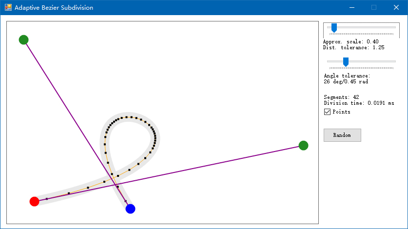

# Adaptive Curve Subdivision

C# port of the adaptive curve subdivision part of Maxim Shemanarev's [Anti-Grain Geometry](http://www.antigrain.com/) (AGG).
Theories can be found [here](http://www.antigrain.com/research/adaptive_bezier/index.html).

There is a GUI tool to visualize the subdivision result.

Note that this library is intended for internal use, so it depeneds on external libraries for foundamental data structures.

Requires .NET Framework 4.5.

## License

[Anti-Grain Geometry Public License / Modified BSD 3-Clause License](copying.txt)
